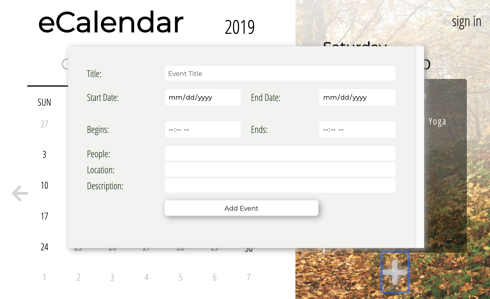
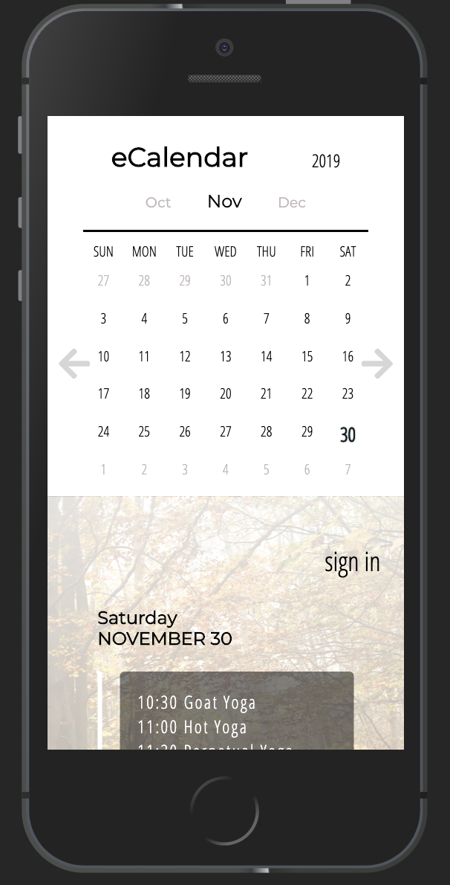
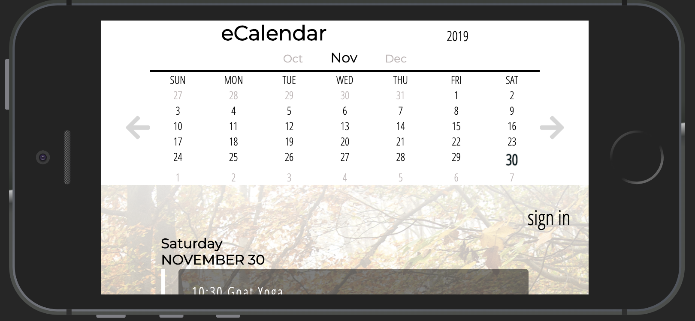
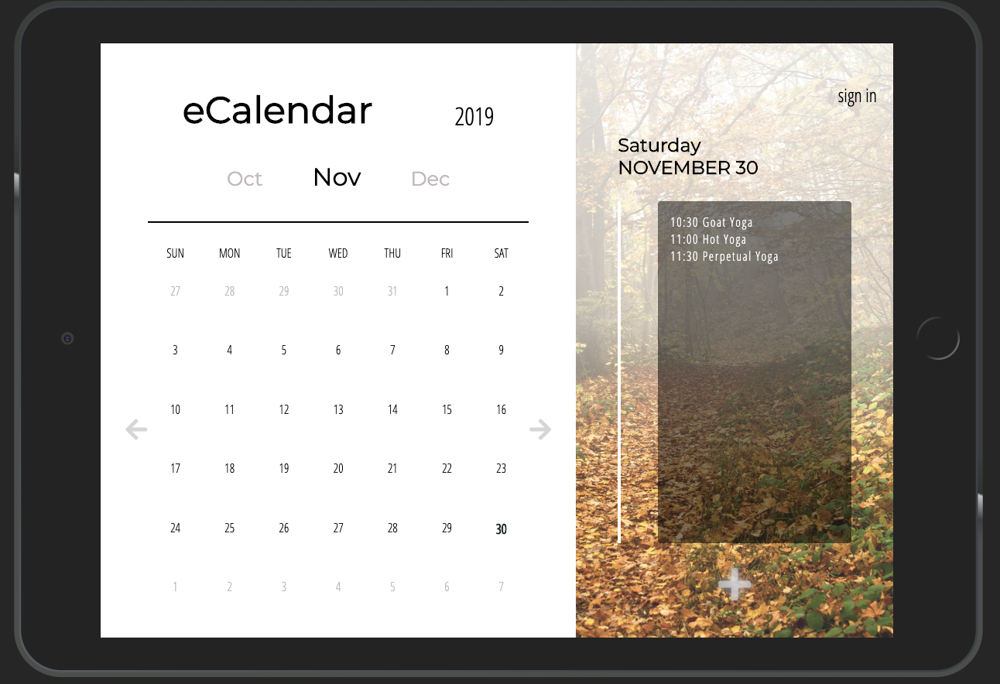

# Chingu Solo Project - Tier 3 - eCalendar

 
---
 

## Overview 

This project is a great opportunity to develop a clean and modern webpage. The *eCalendar* app will be completed across tiers, with each tier adding a new level of complexity. You are currently on the **Tier 3 repo**. You'll be responsible for coding the **HTML**, **CSS**, and **JavaScript** to get the structure, styling, and some basic functionality up and running.

As you add skills to your developer toolbag you'll be able to come back to this project and add more complex features. Ultimately you'll have a great portfolio piece, and will have implemented a number of common and in-demand features.

**You May Use Libraries and/or Frameworks**

## About Chingu

If you aren’t yet a member of Chingu we invite you to join us. We help our 
members transform what they’ve learned in courses & tutorials into the 
practical experience employers need and want.

Our remote team projects let you refine your technical skills and put them 
into practice while gaining new “soft” skills like communication, 
collaboration, and Agile project management. The types of skills that 
help real-world teams get things done!

You can learn more and join us at [chingu.io](https://chingu.io).

## Instructions

General instructions for all Pre-Work Projects can also be found in the Chingu Voyage Handbook (URL posted in the `#read-me-first` channel on Discord).

#### Requirements

*Structure*

- [ ] Page divided into calendar potion and event list portion

- [ ] Calendar portion to have:  

  - [ ] Title and Current year in header  
  - [ ] Current month between previous and upcoming month 
  - [ ] Calendar dates of the month with display of previous month’s last dates if first day of current month does not start on a Sunday 
  - [ ] Arrows bordering the body of the calendar 

- [ ] Event portion to have

  - [ ]  Current day of the week displayed  
  - [ ]  Current month and date (numerical) displayed  
  - [ ]  List of Events with corresponding date of month divided by a vertical bar  
  - [ ]  Add event button at bottom 

- [ ] Display any appointments for the current date on app load; if no appointments are on the current day display "No Appointments"

- [ ] A modal form activated via button click that floats above the content

*Styling:*

- [ ] Styles should be reminiscent of the demo versions. Feel free to use artistic licencse as long as the functionality doesn't suffer 

*Functionality*

*Upon Load:*

- [ ] Calendar will display correct layout of the current month with the weeks starting on Sunday
- [ ] Displays last days of previous month and/or first days of next month as buffers when needed; set apart with styling
- [ ] Set the current date apart from the others (in the demo above it is bolded)
- [ ] Display the current day in the appointment panel along with any appointments on that day OR a notification of "No Appointments" if none exist for that day

*Scrolling:*

- [ ] Your calendar must scroll backwards and forwards accurately

*Manipulation:*

- [ ] If there are one or more appointments for a day in the displayed month, display a small dot under the day as a visual representation
- [ ] When a user clicks on a day in the currently displayed month, the lables and appointments should update in the appointment panel
- [ ] When a user inputs a new appointment, be sure that the appointment dot under the correct day is shown immediately
- [ ] Implement full CRUD (creat, review, update, delete) lifecycle for appointments (*hint: use the modal for creating/update/delete and the panel for review*);

*Modal Form:*
- [ ] This form is used to add new events to to the calendar. It is displayed when the user clicks the add icon in appointment panel
- [ ] Be able to close form without submission and have form close on submission of event information
- [ ] Have modal displayed as shown in images below
- [ ] Have at least the event name and dates as required, the other fields shown are optional
- [ ] Is hidden when not in use

*Other:*

- [ ] Your repo needs to have a robust README.md
- [ ] Make sure that there are no errors in the developer console before submitting

**Extras (Not Required)**

- [ ] Make your design fully responsive *(small/large/portrait/landscape, etc.)*
- [ ] Optimized loading of calendar site (hint, consider the background image)
- [ ] Change the background image based on the season in which the current displayed month is part of
- [ ] Add either backend persistence or use a webStorage API
- [ ] Incorporate a holiday API to automaticaly display different groups of holidays on the calendar

## Example

*The static images below show the modal form as well as different responsive design implementations*

 

 

 
